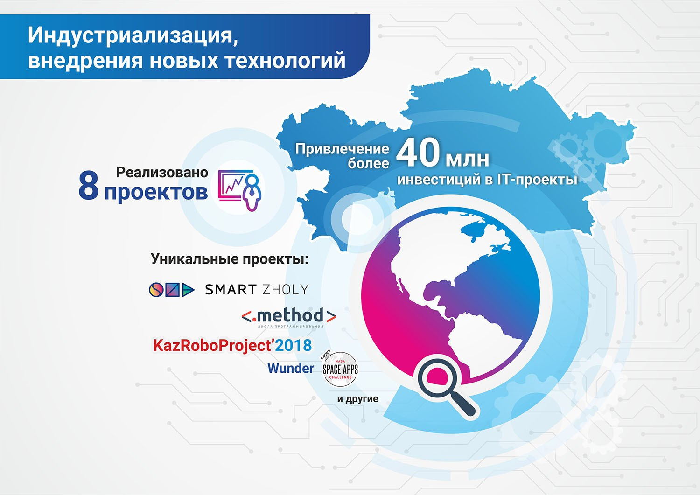

**В рамках программы «Цифровой Казахстан» Фондом реализовано 8 передовых
проектов в сфере цифровизации и развития стартап-экосистемы страны.
При этом создаются примеры лучшей практики не только в Казахстане,
но в Центральной Азии в целом.**

Фонд Первого Президента всего за один год закрепил за собой лидирующие позиции
в поддержке процесса цифровизации страны с помощью собственных уникальных
проектов: **Smart Zholy, Method PRO**, Республиканский чемпионат по робототехнике
**«KazRoboProject», Wunder** и другие. Все это создает целую экосистему
странового масштаба со множеством элементов, которые все вместе помогают
развивать Цифровой Казахстан.

Фонд планирует масштабировать эти беспрецедентные результаты, чтобы закрепить
за Астаной статус новой стартап-столицы на карте мира.

### Smart Zholy
**Программа Фонда Smart Zholy - это уникальная площадка, которая позволяет
молодым казахстанским стартапам выходить на глобальный рынок.**

В этом году, благодаря **Smart Zholy, создан прецедент привлечения венчурных инвестиций от сингапурского фонда в казахстанский стартап Intellection**. Казахстанский стартап Webtotem в рамках **Smart Zholy попал в Топ-10 лучших стартапов Юго-Восточной Азии** и стал лучшим в категории «Программное обеспечение для предприятий». Еще **7 стартапов** получили возможность представить свои проекты перед ведущими венчурными фондами **в Сингапуре** на партнерской площадке Echelon Asia Summit. Всего в программе Smart Zholy приняли участие **16 городов** Казахстана. В них прошли специальные образовательные тренинги с охватом более **1200 молодых людей**. Это способствует развитию площадок цифровизации во всех регионах.

###### СМАРТ ЖОЛЫ

### Wunder
**20 школ со всех регионов и городов Астана и Алматы пройдут пилотное обучение
программированию. Учащиеся получают специальные знания, будут создавать
мини-проекты и приложения, а также закрепят практические навыки с помощью
тестов.**

Курс разработан компанией Intellection Studio, с использованием опыта лучших онлайн-школ (MIT online lectures, Coursera, Udacity). Цель проекта – в каждой школе Казахстана внедрить занятия, на которых ученики смогут получать знания о современных и востребованных методах программирования.

В рамках программы Smart Zholy были организованы встречи с международными инвесторами: **привлечены инвестиции в размере 32 млн. тенге ($90 000)**. Сингапурская компания Saturday Kids профинансирует казахстанский стартап Intellection Studio, занимающийся разработкой образовательных IT-программ для школьников и студентов.

Данный проект планируется экспортировать как образовательную услугу сначала в
Сингапур, а далее на глобальный англоязычный рынок.

### Method PRO
**Проект Method PRO – это летняя IT-стажировка для школьников и студентов со
всех регионов. Программа объединила талантливую молодежь, специалистов
IT-индустрии и крупные компании.**

Впервые данный проект был запущен в 2017 году: в результате **4 проекта** наших
студентов были внедрены в производство, ребята заработали более **3 миллионов**
тенге и получили возможность трудоустройства в крупные национальные компании.

В этом году поступило более **1000 заявок** от претендентов из **15 стран** ближнего и
дальнего зарубежья. По итогам конкурсного отбора **200 человек** с июня по август
успешно прошли IT - стажировку в городах Астана и Алматы. Лучшие команды
заработали более **8 миллионов тенге и получили 30 предложений о трудоустройстве**.

<video controls>
  <source src="../assets/videos/Method.mp4#t=0.5" type="video/mp4" />
</video>

Студенты разработали **40 проектов** – это программные решения для крупных
отечественных компаний.

### KazRoboProject-2018
**В июне 2018 года Фонд совместно с Федерацией образовательной и спортивной
робототехники организовал республиканский конкурс «KazRoboProject-2018»,
целью которого является развитие и популяризация образовательной и спортивной
робототехники в Казахстане среди детей и юношества.**

**26 лучших проектов** со всех регионов были представлены в здании Назарбаев Центра,
**6 проектов** стали победителями. Один из призёров KazRoboProject-2018 - **Любовь
Дудченко, она заняла I место с проектом для незрячих людей «Oqyp ko’r»**.
Мобильное приложение позволяет декодировать любой текст или аудио на шрифт
Брайля. Данный проект продолжил свою победную историю: он получил **признание
на международном конкурсе научно-технических инноваций CASTIC-2018 в городе
Чунцин (Китай), занял I место и удостоился двух специальных номинаций.**
Победы и успех нашей талантливой молодежи на международных площадках - результат
качественной работы Фонда.

### Nasa Space Apps Challenge

**Команда Фонда Н. Назарбаева завоевала первое место в Международном конкурсе «NASA SPACE APPS CHALLENGE» (США)**

Конкурс направлен на исследование космоса и Земли, с программой, позволяющей предсказывать возможные катастрофы, а также представила робота, который способен собирать данные вблизи вулканов или на астероидах. Тимур Рыспеков, Владислав Полонский и Настя Клещева являются многократными чемпионами республиканских и международных конкурсов и олимпиад по информатике и робототехнике. Всего в конкурсе приняли участие более 25 тысяч человек из почти 70 стран мира, в том числе из США, Китая, Индии и др. Финал конкурса прошел в г. Нью-Йорк.

