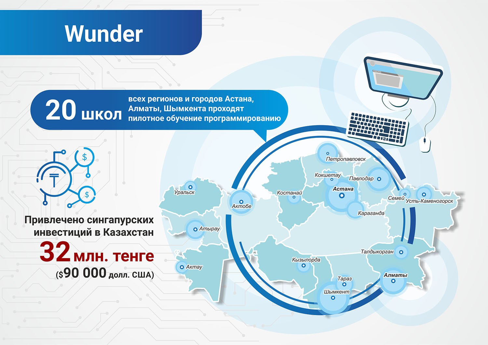

**В рамках программы «Цифровой Казахстан» Фондом реализовано 7 проектов.
Осуществляются передовые проекты в сфере цифровизации и развития
стартап-экосистемы страны, при этом создаются примеры лучшей практики
не только в Казахстане, но в Центральной Азии в целом.**

**Фонд Первого Президента всего за один год закрепил за собой лидирующие позиции
в поддержке цифровизации страны через свои уникальные проекты: Smart Zholy,
Method PRO, Республиканский чемпионат по робототехнике «KazRoboProject»,
Wunder и другие.**

Все это создает целую экосистему странового масштаба, соединяя все элементы
для успешного продвижения Цифрового Казахстана. Фонд планирует увеличивать
эти беспрецедентные результаты, закрепляя за Астаной статус новой
стартап-столицы на карте мира.

### Smart Zholy
**Программа Фонда Smart Zholy - это уникальная площадка, которая позволяет
молодым казахстанским стартапам выходить на глобальный рынок.**

В этом году, благодаря Smart Zholy, создан прецедент привлечения венчурных
инвестиций от сингапурского фонда в казахстанский стартап Intellection.
Казахстанский стартап Webtotem в рамках Smart Zholy попал в Топ-10 стартапов
Юго-Восточной Азии и стал лучшим в категории «Программное обеспечение для
предприятий». Еще 7 стартапов получили возможность представить свои проекты
перед ведущими венчурными фондами в Сингапуре на партнёрской площадке Echelon
Asia Summit. Всего в программе Smart Zholy приняли участие 16 городов
Казахстана, в которых прошли специальные образовательные тренинги с охватом
более 1200 молодых людей: тем самым стимулируется развитие площадок
цифровизации во всех регионах.

###### СМАРТ ЖОЛЫ

### Wunder
**В рамках этого проекта в 20 школах всех регионов и городов Астана и Алматы
пройдёт пилотное обучение программированию. Учащиеся получают знания, будут
воплощать мини-проекты и писать приложения, а также закрепят практические
навыки с помощью тестов.**

Курс разработан на примере лучших онлайн-школ (MIT online lectures, Coursera,
Udacity). Цель - внедрить современное и востребованное программирование в
каждую школу Казахстана.

В рамках программы Smart Zholy были организованы встречи с международными
инвесторами, в результате достигнута договоренность об инвестиции в размере
32 млн. тенге ($90 000 долл. США) для казахстанской компании Intellection
Studio, занимающейся разработкой образовательных IT-программ для школьников
и студентов от сингапурской компании Saturday Kids.

Данный проект планируется экспортировать как образовательную услугу сначала в
Сингапур, а далее на глобальный англоязычный рынок.

### Method PRO
**Свое продолжение нашел проект Method PRO - летняя IT-стажировка для школьников
и студентов со всех регионов страны.**

Программа объединила талантливую молодежь, специалистов IT-индустрии и
крупные компании. В этом году данная программа масштабирована на два города -
Астану и Алматы, благодаря этому количество участников увеличилось в два раза.

<video poster="../assets/images/placeholder-video.png">
</video>

### KazRoboProject-2018
**В июне текущего года Фонд, совместно с Федерацией образовательной и спортивной
робототехники организовал Республиканский конкурс «KazRoboProject-2018», целью
которого является развитие и популяризация образовательной и спортивной
робототехники в Казахстане среди детей и юношества в возрасте от 10 до 21 года.**

26 лучших проектов со всех регионов были представлены в здании Назарбаев
центра, 6 проектов стали победителями. Одной из победительниц
KazRoboProject-2018 была Любовь Дудченко, занявшая I место с проектом для
незрячих людей «Oqyp ko’r». Это разработка, которая позволяет читать любой
текст или прослушивать любое аудио с помощью перевода на шрифт Брайля,
который осуществляется через мобильное приложение. Данный проект продолжил
свою победную историю, получив признание на международном конкурсе
научно-технических инноваций CASTIC-2018 в городе Чунцин (Китай), там он
занял I место и также удостоился двух специальных номинаций: денежной премии
Фонда известного китайского ученого Гао Шичи и денежной премии компании
"Sanray" из города Чунцин. Победы и успех нашей талантливой молодежи на
международных площадках являются результатом эффективной работы Фонда.

