В рамках реализации программы «Цифровой Казахстан» Фондом проведено 6 проектов. Реализуются передовые программы в сфере цифровизации и развития стартап-экосистемы страны, создавая примеры лучшей практики не только в Казахстане, но в Центральной Азии в целом.

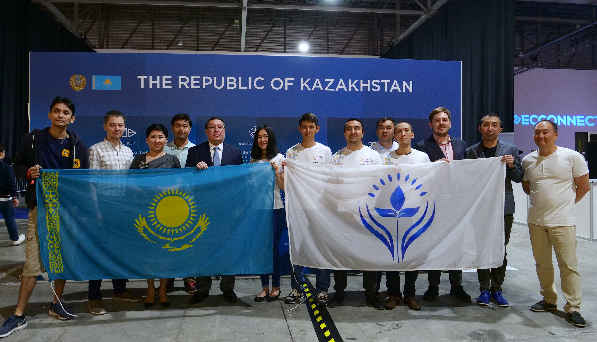

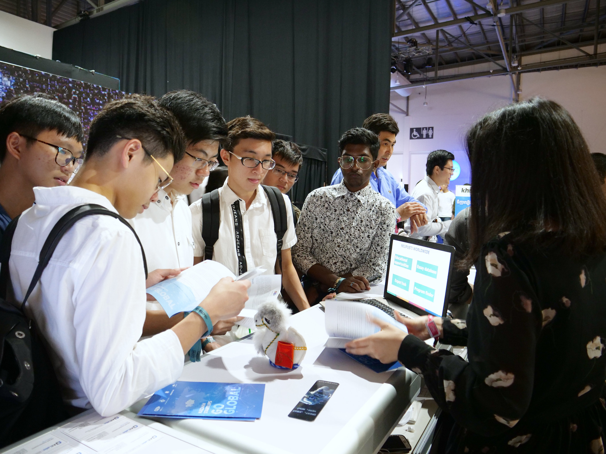

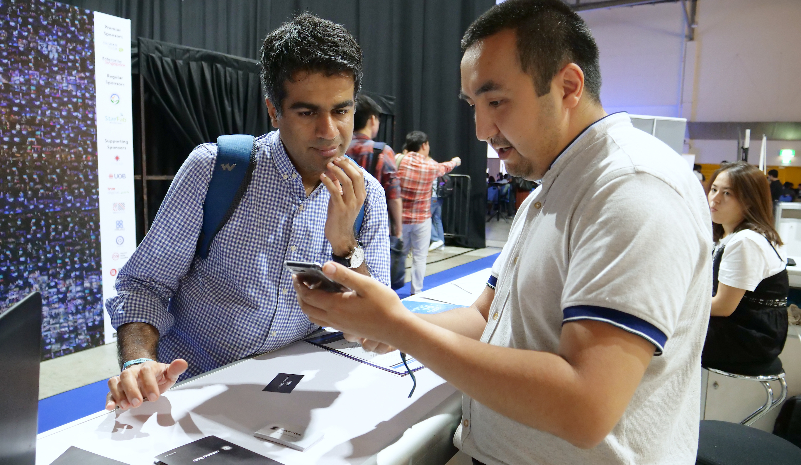

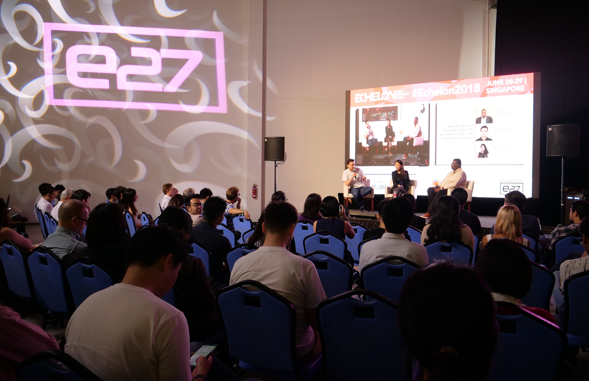

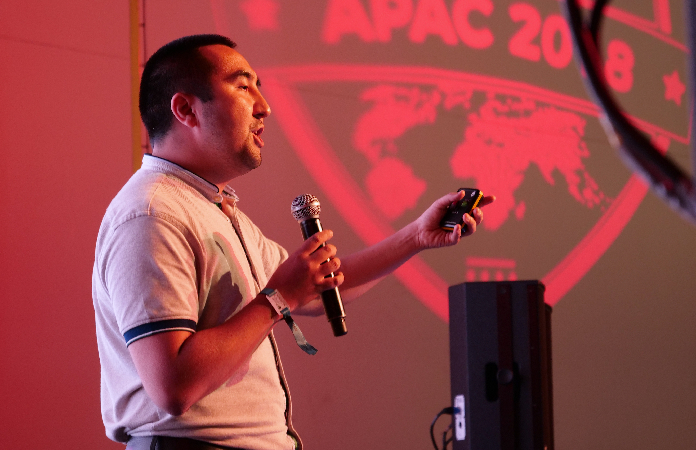

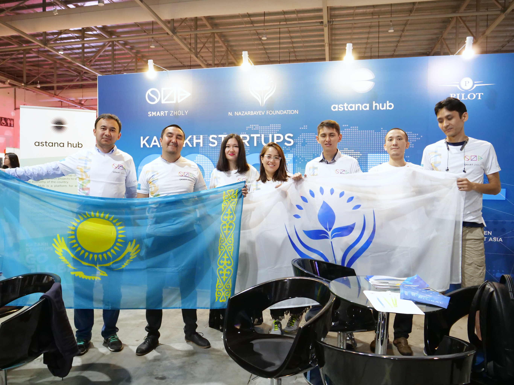

###### СМАРТ ЖОЛЫ

Программа Фонда Smart Zholy - это уникальная площадка, которая позволяет молодым казахстанским стартапам выходить на глобальный рынок. В этом году благодаря Smart Zholy создан прецедент привлечения венчурных инвестиций от сингапурского фонда в казахстанский стартап Intellection. Казахстанский стартап Webtotem в рамках Smart Zholy попал в Топ-10 лучших стартапов Юго-Восточной Азии и стал лучшим в категории «Программное обеспечение для предприятий». Еще 7 стартапов получили возможность представить свои проекты перед ведущими венчурными фондами в Сингапуре на партнерской площадке Echelon Asia Summit.

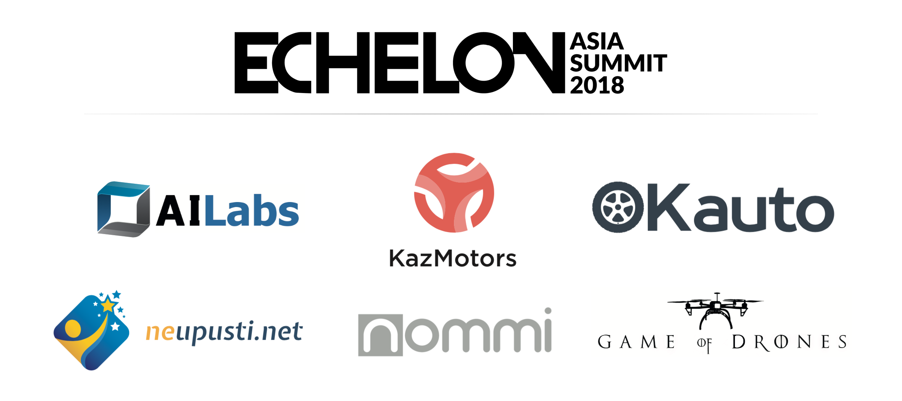
###### Участники Echelon Asia Summit 2018

Всего в программе Smart Zholy приняли участие 16 городов Казахстана, в которых прошли специальные образовательные тренинги, охватив более 1 200 молодых людей, тем самым развивая площадки цифровизации во всех регионах.

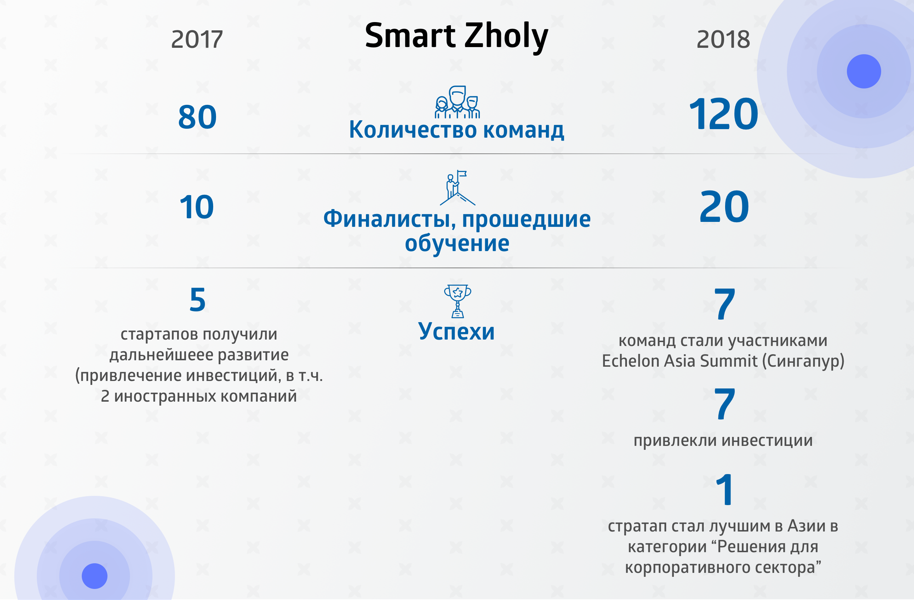
###### Инвестиции Smart Zholy

В рамках программы Smart Zholy были организованы встречи с международными инвесторами, в результате чего достигнута договоренность об инвестиции в размере более 30 млн. тенге ()$90 000 долларов США) для казахстанской компании Intellection Studio, занимающейся разработкой образовательных IT-программ для школьников и студентов от сингапурской компании Saturday Kids. Данный проект планируется экспортировать как образовательную услугу сначала в Сингапур, а далее на глобальный англоязычный рынок.

Свое продолжение нашел проект Method PRO - летняя IT-стажировка для школьников и студентов со всех регионов. Программа объединила талантливую молодежь, IT-индустрию и крупные компании. В этом году данная программа масштабирована на два города Астану и Алматы, тем самым увеличив количество участников в два раза.   

<video controls>
<source src="../assets/videos/Method.mp4" type="video/mp4" />
</video>
###### Method PRO

Фонд Первого Президента всего за один год закрепил за собой передовые позиции в поддержке цифровизации страны через свои уникальные проекты: Smart Zholy, Method PRO, Республиканский чемпионат по робототехнике «KazRoboProject» и другие программы. Все это создает целую экосистему странового масштаба, соединяя все элементы для успешного продвижения Цифрового Казахстана.

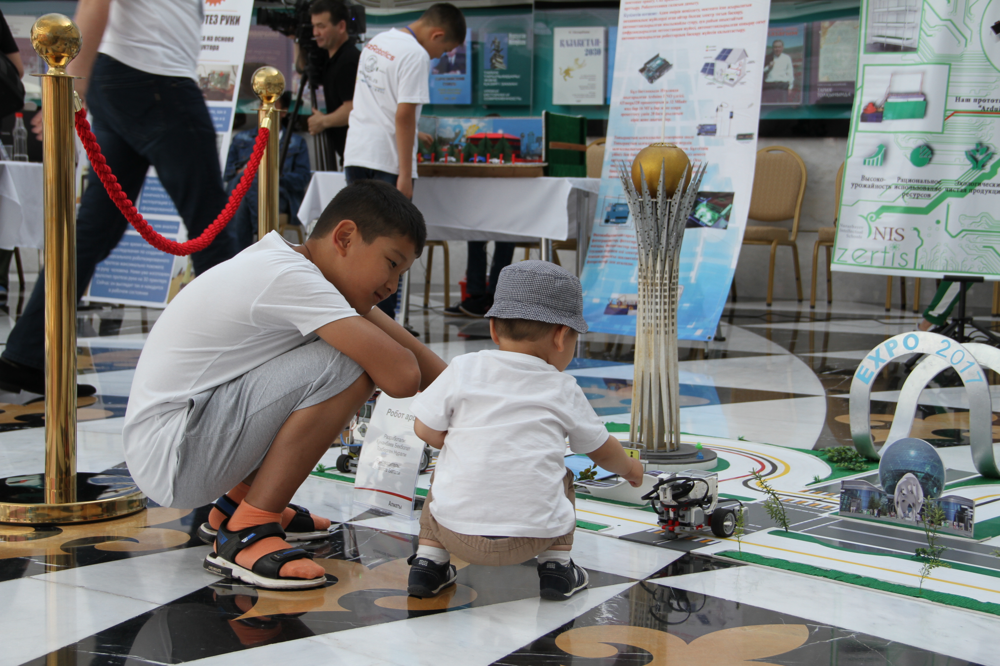

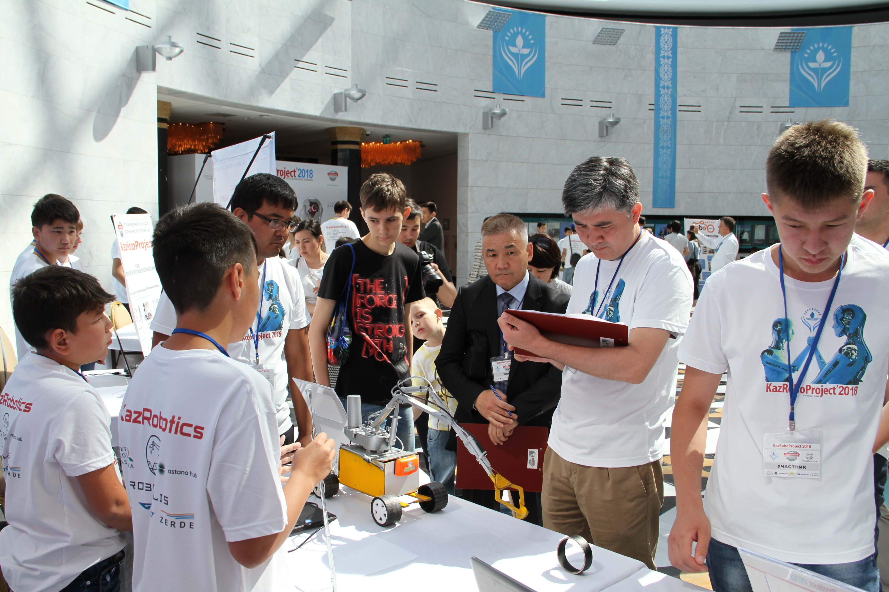

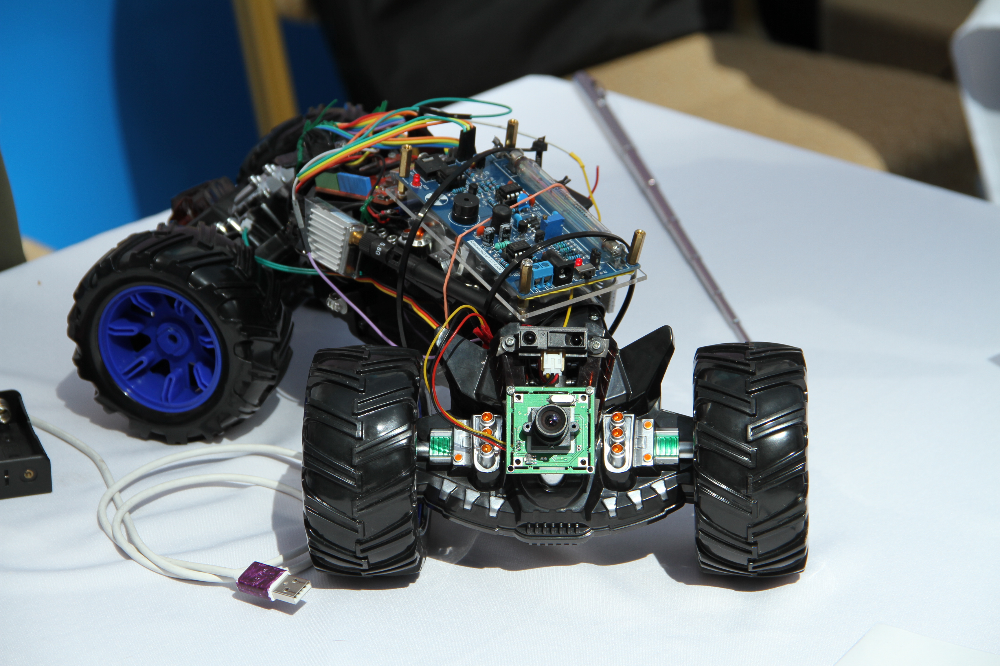

###### Фото с KazRoboProject

Принимая во внимание видение Главы государства по становлению Астаны как регионального хаба по инновационным технологиям, Фонд посредством реализации вышеназванных проектов, вносит свой вклад в данном направлении.
