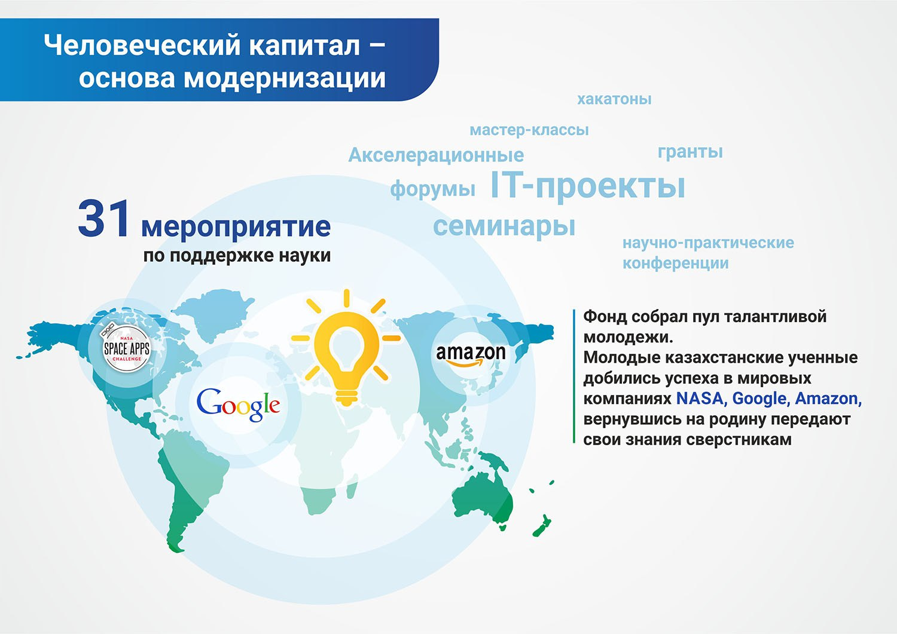
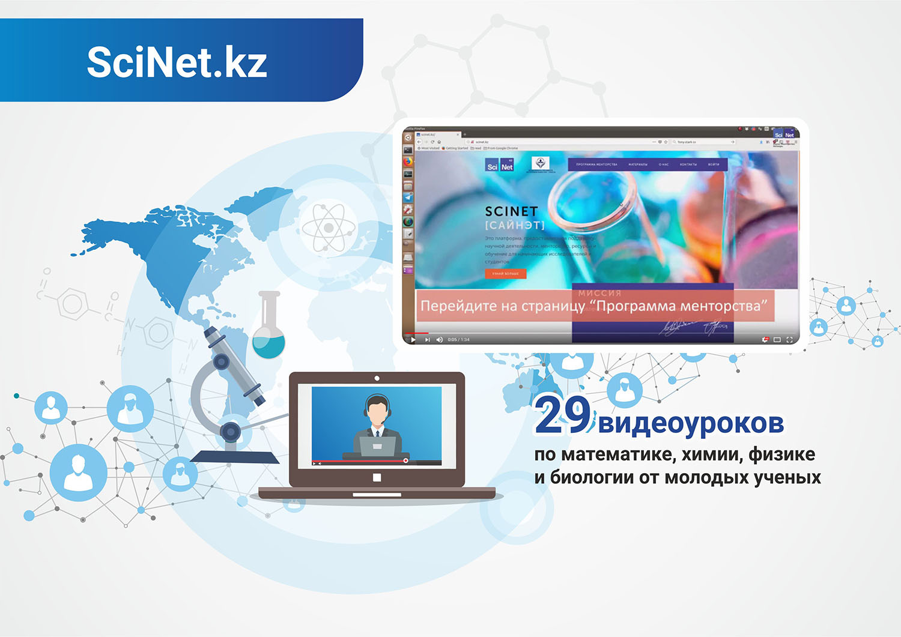
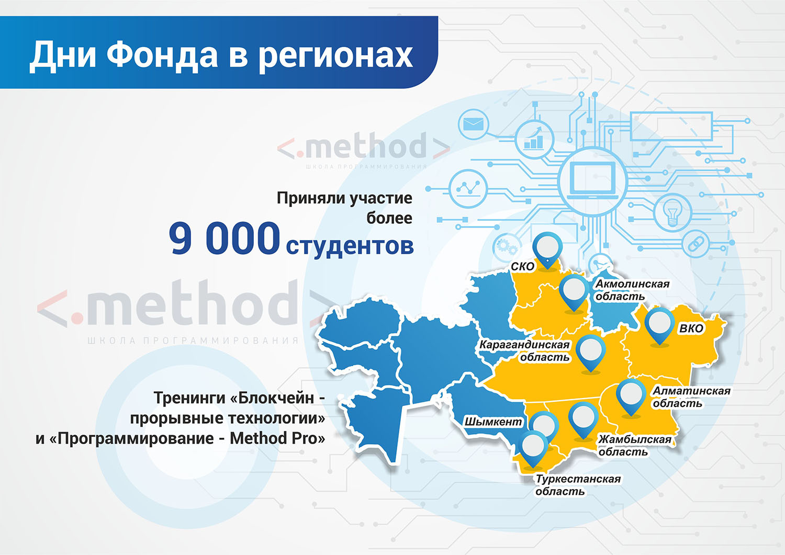

**Фонд уделяет особое внимание программам поддержки молодых учёных – именно от
их исследований и достижений зависит будущее отечественной науки.**

Системная работа Фонда позволила собрать пул талантливой казахстанской молодежи.
Юноши и девушки, которые добились успеха и сотрудничали с технологическими
гигантами - NASA, Google, Amazon - вернулись на родину и передают свои
знания сверстникам.

Акселерационные IT-проекты, хакатоны, научно-практические конференции и форумы,
семинары и мастер-классы – благодаря программам и грантам Фонда, молодые ученые
смогли сделать свои первые открытия, пройти стажировку в лучших научных центрах
мира и наладить контакты с международным научным сообществом. Всего за 9
месяцев организовано и проведено **29 мероприятий**.  

### SciNet.kz

**Программа SciNet.kz, реализуемая при поддержке Фонда – это платформа,
которая обеспечивает поддержку в научной деятельности, поиске ресурсов и
способов обучения для студентов и начинающих ученых.**

Силами молодых учёных-менторов, получивших образование в лучших университетах
мира, созданы **29 видео-уроков по математике, химии, физики и биологии** на
казахском и русском языках, ролики доступны для подписчиков на Youtube.

### Конкурс Фонда Н. Назарбаева среди школьников

**40 школьников отправились в университет Крэнфилда (Великобритания)
на учебно-ознакомительную стажировку**.

Совместно с Министерством юстиции РК был проведен республиканский конкурс в
области авиатранспортной инженерии среди школьников в возрасте 16-18 лет. В
июле т.г. в Назарбаев Центре был проведен отборочный тур.

Во время стажировки ребята получили теоретические и практические знания о
принципах работы и проектированию авиационной и другой техники, приборостроению.
Кроме того, они учились управлять самолётом с помощью симуляторов, получили опыт
свободного падения в аэродинамической трубе, участвовали в различных спортивных
мероприятиях, организованных специально для ребят представителями
аэрокосмической школы. Семинары проводили опытные педагоги.
Стажировка завершилась экскурсией по Лондону и Кэмбриджу.
По словам ребят они получили бесценный опыт и полезные знания.

Организаторы: Назарбаев университет и университет Крэнфилд. Партнеры:
Национальный перевозчик Air Astana и Корпоративный фонд «Samruk – Kazyna Trust».

### Дни Фонда в регионах

Дни Фонда Первого Президента Республики Казахстан – Елбасы в регионах являются
масштабным проектом, в рамках которого особую значимость приобретает
сотрудничество Фонда с местными исполнительными органами для поддержки
талантливой и активной молодежи, обмена опытом, совместной работы в
области образования и культуры.

Поддерживая передовые тренды, Фонд организовал тренинги "Блокчейн - прорывные
технологии" и «Програмирование - Method Pro» в Северо-Казахстанской,
Жамбылской и Восточно-Казахстанской областях, эти занятия посетило более **3 500 студентов**.

Деятельность Фонда в регионах дает возможность раскрыть потенциал молодежи
путем вовлечения их в такие проекты Фонда, как ярмарка социальных идей, ряд
стипендиальных и грантовых программ.

### Rocketfest

**Самый масштабный развлекательно-образовательный фестиваль для молодежи** - впервые организованный Фондом Первого Президента совместно с образовательным акселератором «Rocket Study».

«RocketFest» - это уникальная площадка, полезнейшая молодежная тусовка, нацеленная на продвижение идеологии саморазвития и самореализации молодежи, содействие развитию личностных и профессиональных качеств молодежи. Фестиваль, главным образом, ориентирован на интересы, потребности и цели молодых казахстанцев.

«RocketFest» содействует раскрытию потенциала в создании и реализации креативных идей и проектов, которые выведут Казахстан на новый уровень развития.

Более **1 000** молодых людей в возрасте от 12 до 22 лет стали участниками обширной программы Фестиваля. Перед молодежью выступают специально приглашенные спикеры, добившиеся впечатляющих успехов в самых разных сферах жизни — представители науки, образования, известные блогеры и вайнеры, лидеры общественного мнения, медиа и IT-стартаперы, СЕО, успешные бизнесмены.

Программа Фестиваля была разделена на три Модуля – «IT», «Социальные медиа» и «Наука». Каждый из них состоит из ряда конкретных направлений.

### Международный форум молодых учёных «Burabay Forum»

С 8 по 10 августа в городе Астана и в Акмолинской области прошел II
Международный форум молодых ученых «Burabay Forum». Учёные и представители
государственных органов обсудили развитие взаимодействия Казахстана и стран
СНГ в нескольких направлениях: сельское хозяйство, сотрудничество в сферах
науки, культуры, туризма, а также наукоёмких технологий.

В этом году в Форуме приняло участие более **100** ученых, среди них **27** зарубежных
(Россия, Литва, Беларусь, Армения, Азербайджан, Узбекистан, Кыргызстан, Таджикистан).

Цель форума - предоставить возможность молодым учёным обмениваться информацией,
инициировать и реализовывать совместные международные научные проекты,
коммерциализировать результаты научных изысканий.

### Международный Симпозиум молодых ученых «Кызылжар-2018»

**В Петропавловске и Шалкар-Имантауской курортной зоне обсудили перспективы развития туристского потенциала приграничных территорий Казахстана и России. Мероприятие стало логическим продолжением Burabay Forum, на котором летом текущего года молодые ученые из стран СНГ и Европы обсуждали вопросы трансграничного сотрудничества в сфере науки, образования и туризма.**

В Северо-Казахстанский государственный университет им. М. Козыбаева при поддержке Фонда Первого Президента РК – Елбасы организовал Международный Симпозиум молодых ученых «Кызылжар-2018» по развитию туризма приграничных и пограничных территорий в рамках Форума приграничных территорий Казахстана и России с участием Президентов двух стран, который состоится 9 ноября 2018 г. Несколько дней молодые ученые обсуждали существующие и потенциальные возможности использования туристского потенциала приграничных территорий, включающих обширные равнинные и горные территории, морские и речные участки.

Развивать взаимодействие Казахстана и России молодые ученые решили по направлениям географии и экономики туризма.  Участниками казахстанско-российского Симпозиума стали 30 молодых ученых в возрасте до 40 лет.

В рамках Симпозиума состоялась встреча его участников с руководителями государственных органов власти и общественных объединений Республики Казахстан.

Молодые ученые Казахстана и России изучили механизмы сотрудничества приграничных территорий двух стран и обсудили возможности не разграничения и разъединения, а интеграции приграничных территорий, синергии совместного взаимодействия в области развития туризма.

Воплотить задуманное в жизнь участникам Симпозиума «Кызылжар-2018» помогла поездка в Айыртауский район Северо-Казахстанской области, где, наряду со знакомством с музейно-археологическими объектами, им были представлены зарождающийся современный туристский кластер с современным горнолыжным курортом, ориентированный, прежде всего, на жителей и гостей нашей столицы. Руководство района представило участникам Симпозиума свою концепцию развития туристской индустрии в свете Государственной программы развития туризма Республики Казахстан до 2023 г.

### III Baikonyr Short Film Festival

В Алматы с 20 по 23 сентября проходил «III Baikonyr Short Film Festival». Проект был реализован при поддержке Фонда Первого Президента РК – организаторы фестиваля стали обладателями гранта на реализацию творческого проекта.

«Baikonyr Short Film» Festival» создан, чтобы поддержать молодых кинематографистов и развития казахстанской киноиндустрии. В этом году кинофестиваль проводился в третий раз.

Программа «Baikonyr Short Film Festival» состоял из конкурсных и внеконкурсных показов. Правом обладать статуэткой могли только казахстанские кинематографисты. Прием заявок на участие в фестивале завершился 31 августа 2018 года. В этом году подали 195 заявок на участие. Однако прошли только 47 работ.Работы молодых номинантов оценивали известные актеры и режиссёры. Среди них: кинокритик, член FIPRESCI и NETPAC, член Союза кинематографистов Кыргызстана - Гульбара Толомушова, актриса Аружан Джазильбекова, продюсер и актриса Баян Алагузова, режиссер и сценарист Адай Абельдинов, продюсер и режиссер Нуртас Адамбай, режиссер Баймурат Жуманов, режиссер Катерина Суворова и звукорежиссер Денис Коноплев.

### Церемония награждения лауреатов Фонда

Победы и успех нашей талантливой молодежи на международных площадках являются
результатом эффективной работы Фонда. Получить звание Лауреата Фонда Перового
Президента РК – Елбасы весьма престижно.

С каждым годом растёт количество кандидатов на звание Лауреата Фонда Первого
Президента. На сегодняшний день более **220 молодых казахстанских представителей
науки и культуры удостоены этоё престижной наргады**. В феврале 2018 года в
Назарбаев Центре прошло очередное вручение Премии: были названы **новые имена,
21 лауреат получил свою заслуженную награду**.

###### Лауреаты Фонда Первого Президента

