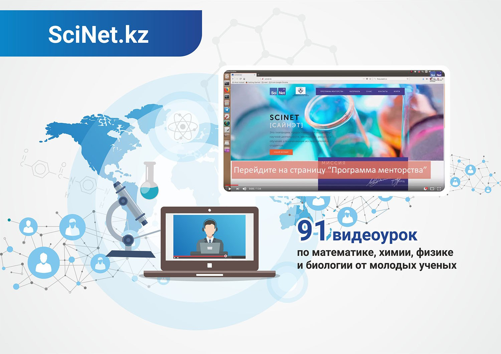

**Фонд уделяет особое внимание программам поддержки молодых учёных – именно от
их исследований и достижений зависит будущее отечественной науки.**

Системная работа Фонда позволила собрать пул талантливой казахстанской молодежи.
Юноши и девушки, которые добились успеха и сотрудничали с технологическими
гигантами - NASA, Google, Amazon - вернулись на родину и передают свои
знания сверстникам.

Акселерационные IT-проекты, хакатоны, научно-практические конференции и форумы,
семинары и мастер-классы – благодаря программам и грантам Фонда, молодые ученые
смогли сделать свои первые открытия, пройти стажировку в лучших научных центрах
мира и наладить контакты с международным научным сообществом. Всего за 8
месяцев организовано и проведено 20 мероприятий.  

### SciNet.kz

**Программа SciNet.kz, реализуемая при поддержке Фонда – это платформа,
которая обеспечивает поддержку в научной деятельности, поиске ресурсов и
способов обучения для студентов и начинающих ученых.**

Силами молодых учёных-менторов, получивших образование в лучших университетах
мира, созданы 29 видео-уроков по математике, химии, физики и биологии на
казахском и русском языках, ролики доступны для подписчиков на Youtube.

### Конкурс Фонда Н. Назарбаева среди школьников

Совместно с Министерством юстиции РК был проведен республиканский конкурс в
области авиатранспортной инженерии среди школьников в возрасте 16-18 лет. В
июле т.г. в Назарбаев Центре был проведен отборочный тур. 40 школьников
отправились в университет Крэнфилда (Великобритания) на учебно-ознакомительную
стажировку.

Во время стажировки ребята получили теоретические и практические знания о
принципах работы и проектированию авиационной и другой техники, приборостроению.
Кроме того, они учились управлять самолётом с помощью симуляторов, получили опыт
свободного падения в аэродинамической трубе, участвовали в различных спортивных
мероприятиях, организованных специально для ребят представителями
аэрокосмической школы. Семинары проводили опытные педагоги.
Стажировка завершилась экскурсией по Лондону и Кэмбриджу.
По словам ребят они получили бесценный опыт и полезные знания.

Со – организаторы: Назарбаев университет и университет Крэнфилда. Партнеры:
Национальный перевозчик Air Astana и Корпоративный фонд «Samruk – Kazyna Trust».

### Дни Фонда в регионах

Дни Фонда Первого Президента Республики Казахстан – Елбасы в регионах являются
масштабным проектом, в рамках которого особую значимость приобретает
сотрудничество Фонда с местными исполнительными органами для поддержки
талантливой и активной молодежи, обмена опытом, совместной работы в
области образования и культуры.

Поддерживая передовые тренды, Фонд организовал тренинги "Блокчейн - прорывные
технологии" и «Програмирование - Method Pro» в Северо-Казахстанской и
Жамбылской областях, эти занятия посетило более 2 600 студентов.

Деятельность Фонда в регионах дает возможность раскрыть потенциал молодежи
путем вовлечения их в такие проекты Фонда, как ярмарка социальных идей, ряд
стипендиальных и грантовых программ.

### Международный форум молодых учёных «Burabay Forum»

С 8 по 10 августа в городе Астана и в Акмолинской области прошел II
Международный форум молодых ученых «Burabay Forum». Учёные и представители
государственных органов обсудили развитие взаимодействия Казахстана и стран
СНГ в нескольких направлениях: сельское хозяйство, сотрудничество в сферах
науки, культуры, туризма, а также наукоёмких технологий.

В этом году в Форуме приняло участие более 100 ученых, среди них 27 зарубежных
(Россия, Литва, Беларусь, Армения, Азербайджан, Узбекистан, Кыргызстан, Таджикистан).

Цель форума - предоставить возможность молодым учёным обмениваться информацией,
инициировать и реализовывать совместные международные научные проекты,
коммерциализировать результаты научных изысканий.

### Церемония награждения лауреатов Фонда

Победы и успех нашей талантливой молодежи на международных площадках являются
результатом эффективной работы Фонда. Получить звание Лауреата Фонда Перового
Президента РК – Елбасы весьма престижно.

С каждым годом растёт количество кандидатов на звание Лауреата Фонда Первого
Президента. На сегодняшний день более 220 молодых казахстанских представителей
науки и культуры удостоены этоё престижной наргады. В феврале 2018 года в
Назарбаев Центре прошло очередное вручение Премии: были названы новые имена,
21 лауреат получил свою заслуженную награду.

###### Лауреаты Фонда Первого Президента

