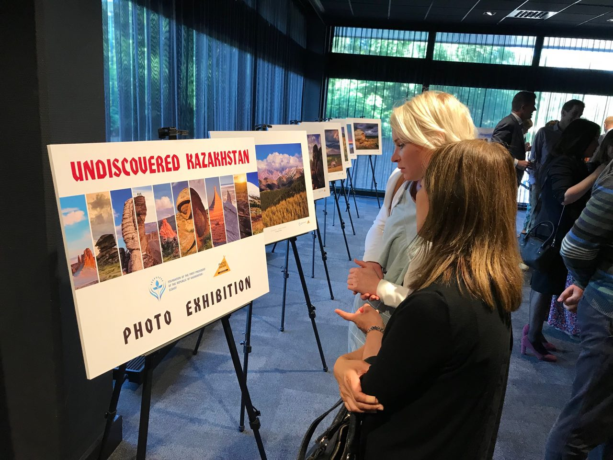

С целью популяризации внешнеполитических мирных инициатив Главы государства и формирования благоприятного международного имиджа, укрепления дружественных и взаимовыгодных отношений с аналогичными международными партнерами, Фонд проводит системную работу с дипломатическими корпусами, аккредитованными в Республике Казахстан и с зарубежными организациями со схожими миссиями.
С начала года Руководством Фонда проведено 11 двусторонних встреч с Чрезвычайными и Полномочными Послами Германии, Франции, Италии, США, Китая, России, Японии, Азербайджана в ходе которых была презентована деятельность Фонда, обсуждались перспективы сотрудничества в области социальных и молодежных проектов, образования и науки, продвижения глобальных идей Президента РК в области ядерного разоружения, построения мер доверия в системе международных отношений.

###### Нужно название

В течение отчетного периода Фондом было подписано                    4 меморандума о сотрудничестве с международными авторитетными организациями такими как: Дом Азии (Casa Asia) при Правительстве Королевства Испания (Испания), Санкт-Петербургским государственным университетом (Россия), Казахстанско-немецким университетом и Германской службой академических обменов (DAAD), а также подписан Меморандум о взаимопонимании с Международным детским фондом ООН – ЮНИСЕФ. Меморандумы дают возможность системно продвигать и реализовывать совместные проекты в области образования и науки, искусства и культуры, проведения аналитических исследований и созданию дискуссионных площадок для обмена мнением и опытом по актуальным темам.  
Особую значимость приобретает широкое освещение и обсуждение книги Главы государства «Эра независимости». Официальная презентация данного труда прошли  в                              гг.Москва и Санкт-Петербург (РФ), где основными спикерами выступили международные и государственные деятели, как Первый Президент Республики Ингушетии, Герой Советского Союза Руслан Аушев, специальный представитель Президента Российской Федерации по международному и культурному сотрудничеству – Михаил Швыдкой и другие.

<video poster="../assets/images/placeholder-video.png">
</video>
###### Презентаци книги в Москве. https://www.ktk.kz/ru/news/video/2018/04/04/93246

Презентация прошла в новом формате посредством телемоста между Астаной и Москвой (в здании международного информационного агентства «Россия сегодня» (РИА-новости). В Астане в телемосте спикерами выступили видные государственные и общественные деятели.

###### Фото телемоста

В рамках расширения международных связей, в октябре т.г. планируется проведение презентации книги «Эра независимости» на английском языке в г.Лондон (Великобритания) с презентацией деятельности Фонда.
Деятельностью Фонда заинтересованы ведущие международные азиатские партнеры, такие  как Korea Foundation (Республика Корея) и Фонд Мира Гойи (Япония). Так, в сентябре т.г. запланирована встреча в Назарбаев Центре с Президентом Фонда Мира Гойи с г-ном Сайонджи, в рамках которой планируется подписание Меморандума о сотрудничестве и проведение экспертного круглого стола: «Казахстанско-японское сотрудничество в ядерном разоружении: одна судьба, общие цели», с участием Посольства Японии в РК, Министерства иностранных дел РК, дипломатического корпуса и видных экспертов.   

###### Фото ??

Фондом проводится системная работа с государственными органами Республики Казахстан. Так, совместно с Министерством иностранных дел РК в Назарбаев центре организована Международная научно-практическая конференция «Астана - город мира», где приняли участие свыше 350 человек из 20 стран мира. На конференции были обсуждены геополитические, исторические, экономические, дипломатические, социологические, правовые и иные аспекты, связанные с 20-летием Астаны.

<video poster="../assets/images/placeholder-video.png">
</video>
###### Школьники в университете Крэнфилда

Совместно с Министерством юстиции РК был проведен республиканский конкурс среди школьников в возрасте 16-18 лет в области авиатранспортной инженерии. 24 июля т.г. в Назарбаев центре был проведен отборочный тур по итогам которого команды-финалисты будут направлены в учебно-ознакомительную поездку в университет Крэнфилда (Великобритания) в период с 19 по 26 августа 2018 года.
В рамках 20-летнего юбилея столицы – Астаны, Фондом был дан старт республиканской и международной фотовыставке «Астана – жемчужина Великой степи» и были изданы уникальные фотоальбомы «A day in Astana» и «A day in Burabay», где запечатлены снимки и краткие истории неповторимых объектов Астаны и красивые пейзажи природы казахстанской Швейцарии - Бурабай. Данные фотоальбомы были подарены высокопоставленным гостям и участникам мероприятий.

###### Нужно выбрать фотографии

Европейское турне фотовыставки было дано в г.Мадрид (Королевство Испания) в отреставрированном здании Фонда Карлоса де Амбереса и в штаб-квартире Всемирной туристкой организации ООН. Среди гостей были деловые круги Испании, видные европейские политики, как экс-Комиссар Европейского союза по внешним связам и политике Бенита Ферреро-Вальднер, дипломатический корпус и испанская общественность. Далее европейское турне фотовыставки проходило в  г. Бухарест (Румыния), г.Гаага (Королевство Нидерланды).
Также, фотовыставка была успешно презентована в международном информационном агентстве «Россия сегодня» г.Москва, в Александровском зале Санкт-Петербургского государственного университета в г.Санкт-Петербург, в одном из старейших региональных музеев России – в Астраханском государственном объединенном историко-архитектурном музее-заповеднике г.Астрахань, где приняли участие губернаторы, видные государственные и общественные деятели, казахская диаспора и общественность.

###### Открытие выставки (Европа)

В день юбилея столицы (6 июля) в рамках Меморандума о сотрудничестве между Фондом Первого Президента Республики Казахстан – Елбасы и Фондом Гейдара Алиева, фотовыставка была торжественно презентована в Центре Гейдара Алиева в г.Баку (Азербайджанская Республика). Фотовыставка имела колоссальный успех и большой интерес у представителей министерств и ведомств, депутатов Милли Меджлиса Азербайджана, глав и сотрудников иностранных дипломатических миссий, международных организаций, видных общественных деятелей, ярких представителей творческой интеллигенции, деловых кругов, членов Клуба друзей Казахстана.

