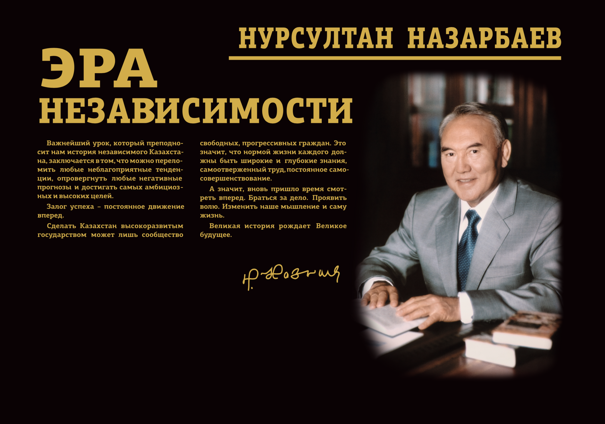

**Фонд ведёт активную работу для популяризации внешнеполитических мирных инициатив Главы государства и формирования благоприятного международного имиджа, для укрепления взаимовыгодных отношений с международными партнёрами, с дипломатическими корпусами, аккредитованными в Республике Казахстан и с зарубежными организациями со схожими миссиями.**

С начала года руководством Фонда проведено 24 мероприятия, в том числе 11
двусторонних встреч с Чрезвычайными и Полномочными Послами Германии,
Франции, Италии, США, Китая, России, Японии, Азербайджана, в ходе которых
была презентована деятельность Фонда, обсуждались перспективы сотрудничества
для продвижения глобальных идей Президента РК в области ядерного разоружения,
укрепления доверия в системе международных отношений, в различных сферах
общественной жизни.

Фондом было подписано 7 меморандумов о сотрудничестве с международными
авторитетными организациями: среди них Дом Азии (Casa Asia) при Правительстве
Королевства Испания, Санкт-Петербургским государственным университетом,
Казахстанско-немецким университетом и Германской службой академических
обменов (DAAD). Также подписан Меморандум о взаимопонимании с Международным
детским фондом ООН – ЮНИСЕФ. Эти документы дают возможность планомерно
продвигать и реализовывать совместные проекты в области образования и науки,
искусства и культуры, проводить аналитические исследования и создавать
дискуссионные площадки для обмена мнениями и опытом.  

Деятельностью Фонда заинтересованы ведущие азиатские партнеры,
такие  как Korea Foundation (Республика Корея) и Фонд Мира Гойи (Япония).

Подписание меморандума с Корейским Фондом в конце августа текущего года
положило начало укреплению долгосрочного и взаимовыгодного сотрудничества
в культурно- гуманитарной и просветительской сферах. Партнёрство будет
осуществляться в рамках совместных мероприятий, дружеских визитов молодежи
Казахстана и Южной Кореи.

В сентябре т.г. также прошла встреча в Назарбаев Центре с Президентом Фонда
Мира Гойи г-ном Сайонджи, на которой был подписан Меморандум о партнёрстве,
а также проведена международная конференция «Казахстанско-японское
сотрудничество в ядерном разоружении: одна судьба - общие цели» с участием
Посольства Японии в РК, Министерства иностранных дел РК, дипломатического
корпуса и авторитетных экспертов.   

### Презентация книги «Эра независимости»

Особое значение имеет работа по освещению и обсуждению книги Главы государства
«Эра независимости». Фонд организовал презентации издания в Москве и
Санкт-Петербурге (РФ). Основными спикерами выступили международные и
государственные деятели: первый Президент Республики Ингушетии, Герой
Советского Союза Руслан Аушев, специальный представитель Президента Российской
Федерации по международному и культурному сотрудничеству Михаил Швыдкой и
другие. Презентации прошли в новом формате – в здании международного
информационного агентства «Россия сегодня» (РИА Новости) был организован
телемост между Астаной и Москвой. В Астане спикерами выступили видные
государственные и общественные деятели.   

В октябре этого года планируется проведение презентации книги «Эра
независимости» на английском языке в Лондоне (Великобритания).

### Региональная конференция «Расширение прав и возможностей женщин в Афганистане»

С учетом международного внимания к Афганистану Казахстан стремится повысить
международную осведомленность и поддержку конкретных потребностей афганских
женщин и девочек, продвинуть и расширить их права и возможности в целях
достижения долгосрочного мира и устойчивого развития в этой стране.

В начале сентября в Астане прошла региональная конференция «Расширение прав
и возможностей женщин в Афганистане». От Казахстана в конференции приняли
участие Государственный секретарь Гульшара Абдыкаликова, Председатель Комитета
по международным отношениям, обороне и безопасности Сената Парламента Дарига
Назарбаева, Министр иностранных дел Кайрат Абдрахманов, Министр труда и
социальной защиты Мадина Абылкасымова, члены Правительства и депутаты Парламента.

Мероприятие посетили высокие гости из других стран: Первая леди Армении Нуне
Саркисян, Вице-Премьер-министр Кыргызстана Алтынай Омурбекова, Заместитель
Премьер-министра Узбекистана Танзила Нарбаева, Министр по делам женщин
Афганистана Дильбар Назари, Министр культуры и информации Афганистана Хасин
Сафи, йеменская правозащитница, журналист и политик, ставшая первой арабской
женщиной-лауреатом Нобелевской премии мира, Тавакуль Карман и др..

В рамках конференции принят итоговый документ, который направлен на расширение
прав и возможностей женщин Афганистана в сфере бизнеса, образования и доступа
к цифровым технологиям.

Данная конференция стала первой в своём роде. Прежде тема прав афганских
женщин не становилась центральной ни на одной дискуссионной площадке.

Мероприятие было организовано МИД РК при поддержке Фонда Первого Президента.

### Институционные преобразования в правовой сфере

#### Конференция по правовым вопросам МФЦА

4 июля 2018г. Фондом Первого Президента – Елбасы в рамках официальной
презентации Международного Финансового Центра «Астана» (МФЦА) в Назарбаев
Центре была организована Конференция по правовым вопросам МФЦА. В мероприятии
приняли участие Государственный секретарь РК Гульшара Абдикаликова,
председатель Конституционного Совета РК Кайрат Мами, Председатель Верховного
суда РК Жакып Асанов, Управляющий Международным Финансовым Центром "Астана"
Кайрат Келимбетов, а также более 300 гостей, в том числе, представители
министерств, посольств, международных арбитражных центров и судов, ведущих
юридических и консалтинговых фирм и финансовых корпораций, а также другие
лица, заинтересованные в услугах МФЦА , Суда МФЦА и МАЦ.

#### Венецианская комиссия

22-23 июня в г.Венеции (Италия) заместитель исполнительного директора И. Рогов
принял участие в 115-м пленарном заседании Европейской комиссии за демократию
через право (Венецианская комиссия). В рамках пленарного заседания состоялась
встреча И. Рогова с Президентом Венецианской Комиссии г-ном Джанни Букиккио.
В ходе беседы стороны обсудили возможности более тесного сотрудничества
Республики Казахстан с Венецианской комиссией и реализации совместных проектов
 в области пропаганды верховенства права и государственности среди молодежи,
 поддержки креативных инициатив в области правового развития страны. И. Рогов
 особо отметил важную роль Фонда в продвижении инициатив Елбасы по построению
 сильного демократического, правового государства.

 

 

 

 

 

 

 

 

 

 

#### Международная конференция «Конституция: воплощение ценностей верховенства права, гражданского общества и современного государства»

28 августа в Назарбаев Центре состоялась международная конференция
«Конституция: воплощение ценностей верховенства права, гражданского общества
и современного государства», посвященная Дню Конституции Республики Казахстан.
Мероприятие было организовано в партнерстве с Конституционным Советом РК,
Европейской комиссией за демократию через право Совета Европы (Венецианской
  комиссией), Офисом программ ОБСЕ в Астане и ведущими университетами столицы.

В её работе приняли участие Государственный секретарь РК Абдыкаликова Г. Н.,
руководители государственных структур Казахстана, представители авторитетных
международных организаций, органов конституционного контроля и известные
учёные-правоведы из 20 стран.  

В рамках конференции состоялась презентация нового Научно-практического
комментария Конституции РК, а также награждение победителей премии «Лучший
молодой юрист – 2018» и конкурса «Эссе по вопросам верховенства Конституции и
конституционного патриотизма».

