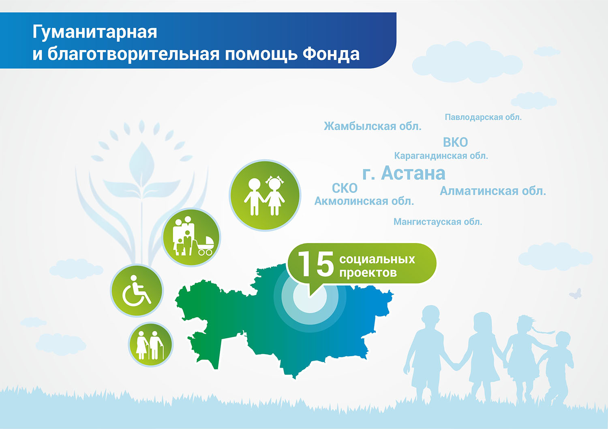

**Продолжая работу по формированию инклюзивного общества, Фонд организовал 14
социальных проектов для детей с особенными потребностями, малоимущих и других
нуждающихся в поддержке групп населения.**

Можно выделить следующие яркие социальные проекты и мероприятия:

### Жаңа көзқарас

Совместно с Посольством Франции в Республике Казахстан был организован уникальный проект «Жаңа көзқарас». В рамках этой инициативы был проведён мастер-класс известного французского фотохудожника Эрика Ваззолера. Результатом стала **фотовыставка работ воспитанников специализированных школ-интернатов для детей с синдроном Дауна**.

### Детские паралимпийские старты «Жеңістерге бірге!»

Вторые детские паралимпийские старты «Жеңістерге бірге!». В этих состязаниях приняли участие более **500** ребят из города Астана и восьми областей Казахстана.

Основной целью Паралимпийских стартов является популяризация и развитие адаптивной физической культуры, развитие новых коммуникативных навыков в сфере инклюзивного образования.

### V детский культурно-спрортивный фестиваль мастер-классов «Аман келешек»

15 сентября 2018 года  в Центре детского отдыха «Arman Dala» в Алматинской области прошёл фестиваль «Аман келешек». В мероприятии приняли участие более **2500** детей.

Главная задача Фестиваля - интеграция детей с ограниченными возможностями и детей-сирот в сферу образования, культуры и спорта с учётом возможностей, и особых потребностей каждого ребенка.   

Гостям была предложена увлекательная интерактивная программа - мастер-классы и игры. Участники фестиваля смогли открыть для себя мир безграничных возможностей, а также заняться тем, что регулярно делают люди с инвалидностью: попробовать свои силы в паралимпийских видах спорта – голболе, бочча, баскетболе на колясках, можно было научиться общаться на языке жестов, писать шрифтом Брайля и пользоваться компьютером с помощью программы озвучивания. А ещё изучить правила этикета при взаимодействии с людьми с инвалидностью. Гостям Фестиваля инклюзии выпала уникальная возможность узнать, что такое доступная среда, параспорт и жестовая песня.

