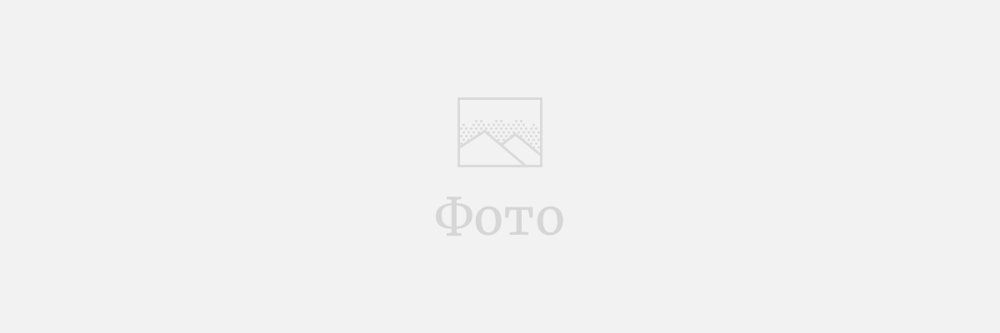

В продолжение своей работы по формированию инклюзивного общества Фонд организовал 13 социальных проектов для детей с особенными потребностями, малоимущих и иных нуждающихся в поддержке групп населения.

Примером таких социальных проектов можно выделить:  

###### Жаңа көзқарас

Совместно с Посольством Франции в Республики Казахстан был проведен уникальный проект «Жаңа көзқарас». Во время проведения данного проекта был организован мастер-класс от известного французского фотохудожника Эрика Ваззолера. Результатом проекта стала фотовыставка картин, сделанных воспитанниками специализированных школ-интернатов для слабовидящих детей гг. Караганды и Алматы.

###### Вторые детские паралимпийские старты «Жеңістерге Бірге!»

Вторые детские паралимпийские старты «Жеңістерге Бірге!». В данном мероприятии принимали участие более 500 ребят из города Астана, а также Акмолинской, Алматинской, Восточно-Казахстанской, Жамбылской, Карагандинской, Мангыстауской, Павлодарской и Северо-Казахстанской областей.
Основной целью Паралимпийских Стартов является популяризация и развитие адаптивной физической культуры, развитие новых коммуникативных навыков в сфере инклюзивного образования.

