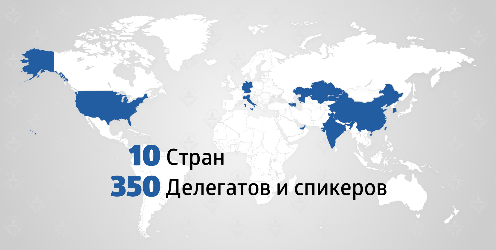

### II Саммит по возобновляемым источникам энергии

**Тема энергоэффективности и энергосбережения обсуждалась в июне этого года в Назарбаев Центре на 2-ом Саммите по возобновляемым источникам энергии, Фонд выступил со-организатором мероприятия.**

В работе международной индустриальной диалоговой площадки приняли участие более **350 делегатов** и спикеров. Цель Саммита – обсуждение использования возобновляемых источников энергии и воплощение лучших идей и эффективных решений, призванных внести вклад в построение «зеленого» будущего нашей страны.

Свои доклады представили более **20 казахстанских и зарубежных спикеров** (из Германии, Италии, Китая, Южной Кореи, Индии, ОАЭ, США, Армении, Азербайджана). Саммит посетили государственные деятели, учёные, предприниматели, нобелевские лауреаты, представители медиа-индустрии. Была составлена **итоговая декларация** для рассмотрения Министерством Энергетики, а также НПП Атамекен и другими бизнес-ассоциациями и заинтересованными ведомствами – **с предложением разработать и начать реализацию первой государственной программы развития отрасли ВИЭ (возобновляемых источников энергии)**.

