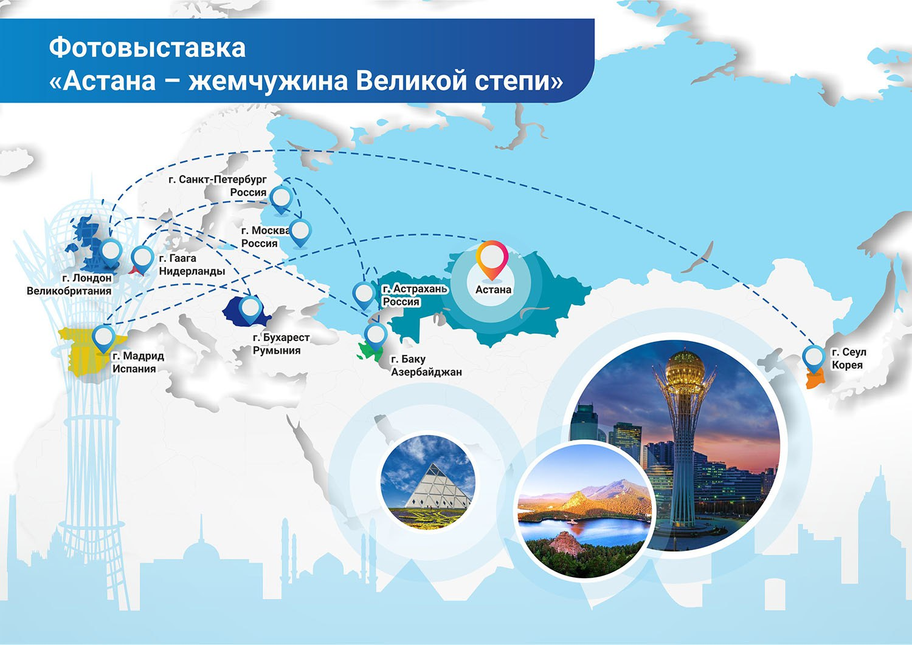

**2018 год ознаменован празднованием 20-летнего юбилея нашей столицы Астаны.
Фондом проведён ряд тематических мероприятий – дабы внести свой вклад в
становление Астаны как одного из важнейших центров развития Евразии.**

### Международная научно-практическая конференция «Астана - город мира»

Совместно с Министерством иностранных дел РК в Назарбаев Центре была
организована Международная научно- практическая конференция «Астана -
город мира», в ней приняли участие более 350 человек из 20 стран мира.
На конференции обсуждались геополитические, исторические, экономические,
дипломатические, социологические и прочие аспекты, связанные с 20-летием столицы.

### Фотовыставка «Астана – жемчужина Великой степи»

В честь 20-летнего юбилея Астаны Фондом был дан старт республиканской и
международной фотовыставке «Астана – жемчужина Великой степи» и были изданы
уникальные фотоальбомы «A day in Astana» и «A day in Burabay». Эти альбомы –
уникальное собрание снимков и историй об Астане и о казахстанской Швейцарии -
Бурабае. Подарочные фотоальбомы были презентованы участникам и гостям мероприятий.   

Пунктами в маршруте европейского турне фотовыставки стали отрестврированное
здание Фонда Карлоса де Амбереса и штаб-квартира Всемирной туристской
организации ООН в Мадриде (Испания). Срежи гостей были видные европейские
политики, в том числе экс-комиссар Европейского союза по внешним связам и
политике Бенита Ферреро-Вальднер, сотрудники дипломатического корпуса,
представители деловых кругов и общественности Испании. Далее европейское
турне фотовыставки продолжилось в  г. Бухаресте (Румыния), г. Гааге
(Королевство Нидерланды).

Также фотовыставка с успехом прошла в здании Международного информационного
агентства «Россия сегодня» (г.Москва), в Александровском зале
Санкт-Петербургского государственного университета в г. Санкт-Петербурге,
а также в одном из старейших региональных музеев России – Астраханском
государственном объединённом историко-архитектурном музее-заповеднике в г.
Астрахани, выставку посетили губернаторы, видные государственные и
общественные деятели, казахская диаспора региона.

В день юбилея столицы 6 июля в рамках реализации Меморандума о сотрудничестве
между Фондом Первого Президента Республики Казахстан – Елбасы и Фондом Гейдара
Алиева фотовыставка была торжественно открыта в Центре Гейдара Алиева в
г.Баку (Азербайджанская Республика). Экспозиция имела колоссальный успех и
вызвала интерес у представителей министерств и ведомств, депутатов Милли
Меджлиса Азербайджана, глав и сотрудников иностранных дипломатических миссий,
международных организаций, общественных деятелей, представителей творческой
интеллигенции, деловых кругов, членов Клуба друзей Казахстана.

