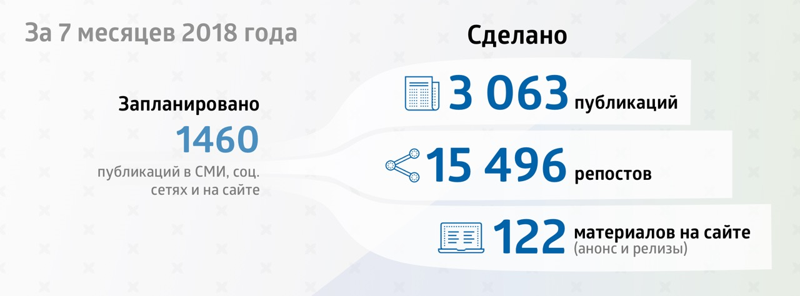
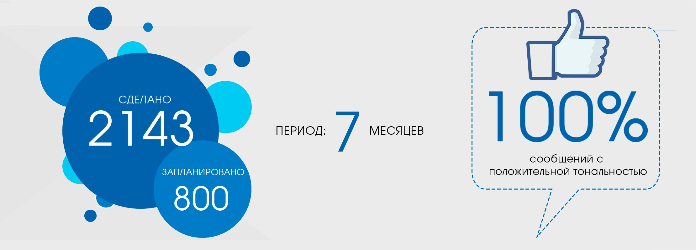
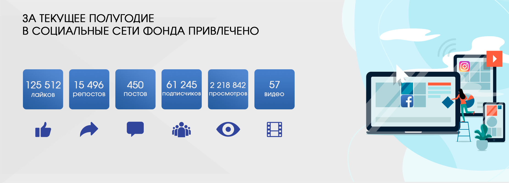

Благодаря проводимой медиа-политике Фонда, ориентированной на Digital медиа, результативность работы по освещению деятельности Фонда в СМИ, в том числе и онлайн, за 7 месяцев 2018 года выросла более чем в 2 раза по сравнению с планом PR-активности (данная работа ведется в рамках утвержденной «Коммуникативной стратегии Фонда на 2017-2020гг.»).

###### Освещение деятельности Фонда в СМИ

За 7 месяцев 2018 года пресс-службой Фонда было запланировано 1460 публикаций в СМИ, социальных сетях и сайте, а по факту за период с 1 января по 31 июля сделано 3063 публикаций и 15 496 репостов, из них материалов на сайте – 122 (анонсы и релизы).

###### Упоминаний и сообщений о проектах в СМИ

Согласно мониторингу СМИ, осуществляемый системой Brand Analytics, с 1 января по 31 июля текущего года о Фонде Первого Президента РК – Елбасы было 2143 упоминаний и сообщений о проектах в СМИ вместо запланированных 800. За период мониторинга в СМИ количество сообщений с положительной тональностью составило 100%. Стоит отметить и географическое расширение освещения деятельности Фонда в зарубежных СМИ на территории Европы, СНГ и Юго-Восточной Азии в рамках реализации международных проектов.

Пятикратное увеличение выходов видеоматериалов Фонда на телевидении – 911 вместо запланированных на 7 месяцев 2018 г. 180 – обусловлено трансляцией документальных фильмов и короткометражных видеороликов, заказанных Фондом с целью популяризации идей Главы государства и укреплению имиджа Фонда, на отечественных телеканалах Хабар, Хабар24, КТК, KazakhTV с общим потенциальным охватом 10 миллионов телезрителей. К примеру: 3 ролика, посвященные инициативам Президента РК «Мир XXI век. Манифест будущего»; 10 роликов, посвященные 20-летию Астаны; документальный фильм «Aстана – столица XXI века». Видеоклип «Елбасының Анасы» транслировался также на музыкальных телеканалах Казахстана Той Думан, GakkuTV, MuzZone с общим потенциальным охватом более 5 миллионов телезрителей.

###### Соц. сети

По состоянию на 31 июля т.г. количество подписчиков в социальной сети FACEBOOK составляет 37 402 подписчика. За 7 месяцев 2018 года 226 постов и 57 видеороликов собрали 15 496 репостов, 42 655 лайков и 2 052 556 просмотров (видеоролики и посты с фотографиями).  

По состоянию на 31 июля т.г. количество подписчиков в социальной сети INSTAGRAM составляет 23 843 подписчиков. За I полугодие 2018 года 224 постов и 57 видеороликов собрали 82 857 лайков и 166 286 просмотров (видеоролики).

За текущее полугодие в социальные сети Фонда привлечено 21418 подписчиков, в том числе в Instagram – 7832, Facebook – 13586.

Такой количественный и качественный рост аудитории в социальных сетях связан с обновленной SMM-политикой Фонда и интересными методами подачи информации: выстроенной политикой и совместной работой SMM-группы и пресс-службы Фонда; внедрением уникального видеоконтента (видеоролики, посвященные проектам Фонда Первого Президента РК, такие как «Награждение Лауреатов Премии Фонда Первого Президента РК», «Дни Фонда Первого Президента РК» в Северо-Казахстанской и Жамбылской областях и др.; 6 эпизодов образовательной интернет-программы «Qonaqjai Elim» о традициях разных этносов, проживающих на территории Казахстана; 1-ый эпизод о вундеркиндах - Wunder Qazaqstan; увеличением прямых эфиров и Stories в Instagram; 1-ый выпуск программы «Юридические диалоги» с участием                И. Рогова); разбавлением основного контента познавательными рубриками как высказывания Елбасы и видных общественных деятелей культуры и образования казахского народа, а также постов, связанных с программой «Рухани Жаңғыру», а также «истории успеха» стипендиатов и грантополучателей Фонда в рубрике #ТалантыФонда. Особый интерес у аудитории вызывают инфографики о профессиях будущего, навыках и новых знаниях в эру цифровизации.

<video poster="../assets/images/placeholder-video.png">
</video>
###### Медиа-библиотека с видео. Сюжеты по годам.

