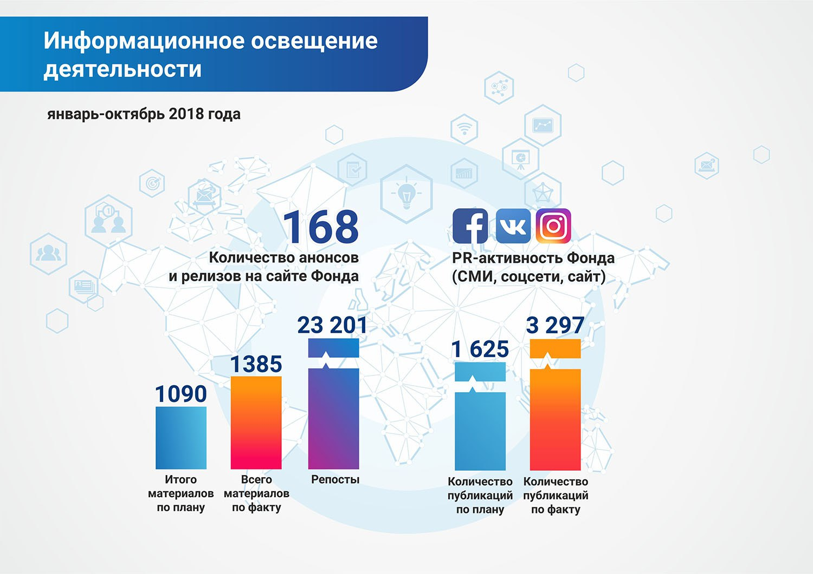

**Благодаря проводимой медиа-политике Фонда, ориентированной на Digital медиа, результативность работы по освещению деятельности Фонда в СМИ, в том числе и онлайн, за 7 месяцев 2018 года выросла более чем в 2 раза по сравнению с планом PR-активности (данная работа ведется в рамках утвержденной «Коммуникативной стратегии Фонда на 2017-2020гг.»).**

За 8 месяцев 2018 года пресс-службой Фонда было запланировано 1605 публикаций в
СМИ, социальных сетях и на сайте, а по факту за период с 1 января по 31 августа
сделано 3522 публикации и 18 288 репостов, из них материалов на сайте 133
(анонсы и релизы).

###### Освещение деятельности Фонда в СМИ

Согласно мониторингу СМИ, осуществляемому системой Brand Analytics, с 1 января
по 31 августа текущего года в СМИ зафиксировано 2453 упоминаний и сообщений о
проектах Фонда Первого Президента РК – Елбасы вместо запланированных 865.
За период мониторинга  СМИ количество сообщений с положительной тональностью
составило 100%. Стоит отметить и географическое расширение освещения
деятельности Фонда в зарубежных СМИ – это страны Европейского союза, СНГ,
Юго-Восточной Азии и Южной Кореи.

Наблюдается пятикратное увеличение выходов видеоматериалов о Фонде на
телевидении – 971 вместо 190 запланированных на 8 месяцев 2018г.. Это
обусловлено трансляцией документальных фильмов и короткометражных видеороликов,
подготовленных по заказу Фонда для популяризации идей Главы государства и
укрепления имиджа Фонда, на отечественных телеканалах Хабар, Хабар24, КТК,
KazakhTV. Общий потенциальных охват показов - 10 миллионов телезрителей.
Это в частности 3 ролика, посвященные инициативам Президента РК «Мир XXI век.
Манифест будущего», 10 роликов, посвященных 20-летию Астаны, документальный
фильм «Aстана – столица XXI века».

Видеоклип «Елбасының Анасы» транслировался также на музыкальных телеканалах
Казахстана Той Думан, GakkuTV, MuzZone: общий потенциальный охват - более
5 миллионов телезрителей.

###### Социальные сети

По состоянию на 31 августа количество подписчиков аккаунта Фонда в социальной
сети Facebook составляет 39 846 пользователей. За 8 месяцев 2018 года 262
поста и 67 видеороликов собрали 18 288 репостов, 54 981 лайк и 2 443 766
просмотров (видеоролики и посты с фотографиями).  

По состоянию на 31 августа количество подписчиков в социальной сети INSTAGRAM
составляет 25 204 пользователей. За 8 месяцев 2018 года 260 постов и 67
видеороликов собрали 115 017 лайков и 196 196 просмотров (видеоролики).

За 8 месяцев в аккаунты Фонда в соцсетях привлечено 25 223 подписчика, в
том числе в Instagram – 9 193, Facebook – 16 030.

Такой количественный и качественный рост аудитории в социальных сетях связан с
обновленной SMM-политикой Фонда и интересными методами подачи информации,
продуманной стратегией и совместной работой SMM-группы и пресс-службы Фонда,
 внедрением публикации уникального видеоконтента. Это, к примеру, ролики,
 посвященные проектам Фонда: «Награждение Лауреатов Премии Фонда Первого
 Президента РК»; «Дни Фонда Первого Президента РК» в Северо-Казахстанской и
 Жамбылской областях; 6 эпизодов образовательной интернет-программы «Qonaqjai
 Elim» о традициях этносов, проживающих на территории Казахстана; 5 эпизодов
 серии роликов о вундеркиндах Wunder Qazaqstan; 4 видео о Шедеврах казахстанского
 искусства; 1-ый выпуск программы «Юридические диалоги» с участием И. Рогова.
 Также увеличено число прямых эфиров и Stories в Instagram,  основной контент
 чередуется с познавательными рубриками, например, «Высказывания Елбасы и видных
 общественных деятелей страны», посты «Рухани Жаңғыру», в рубрике #ТалантыФонда
 публикуются «истории успеха» стипендиатов и грантополучателей Фонда. Особый
 интерес у аудитории вызывает инфографика о профессиях будущего, навыках и
 знаниях, востребованных в эру цифровизации.

 

 <video controls><source src='../assets/videos/fin_war_russ_x264.mp4#t=0.5' type='video/mp4' /></video>
<video controls><source src='../assets/videos/SSTJ-MULT3-RUS_x264.mp4#t=0.5' type='video/mp4' /></video>
<video controls><source src='../assets/videos/fin_ASTANA_RU_x264.mp4#t=0.5' type='video/mp4' /></video>
<video controls><source src='../assets/videos/2016_05_18_Alzir_CUT_Short_CC_ru-Apple ProRes 422_logo1_x264.mp4#t=0.5' type='video/mp4' /></video>
<video controls><source src='../assets/videos/03_EKONOM_RUS_x264.mp4#t=0.5' type='video/mp4' /></video>
<video controls><source src='../assets/videos/2016_12_14_KTK_25_RUS_EFIR_x264.mp4#t=0.5' type='video/mp4' /></video>
<video controls><source src='../assets/videos/01_VERHOVENSTVO_RUS_x264.mp4#t=0.5' type='video/mp4' /></video>
<video controls><source src='../assets/videos/02_POLIGON_Preodolenie_Master_RUS_AIR_50mbps_x264.mp4#t=0.5' type='video/mp4' /></video>
<video controls><source src='../assets/videos/Salem_Sagan_Tugan_Jer_Song_FULLHD_x264.mp4#t=0.5' type='video/mp4' /></video>
<video controls><source src='../assets/videos/02_NACIDENT_RUS_x264.mp4#t=0.5' type='video/mp4' /></video>
<video controls><source src='../assets/videos/fin_SocMult_Zashita_russ_x264.mp4#t=0.5' type='video/mp4' /></video>
<video controls><source src='../assets/videos/fin_deportation_russ_x264.mp4#t=0.5' type='video/mp4' /></video>
<video controls><source src='../assets/videos/fin_SocMult_Zdrav_russ_x264.mp4#t=0.5' type='video/mp4' /></video>
<video controls><source src='../assets/videos/01_POLIGON_Atomnaya Zemlya_Master_RUS_AIR_50mbps_x264.mp4#t=0.5' type='video/mp4' /></video>
<video controls><source src='../assets/videos/03_POLIGON_Apokalips_Master_RUS_AIR_50mbps_x264.mp4#t=0.5' type='video/mp4' /></video>

