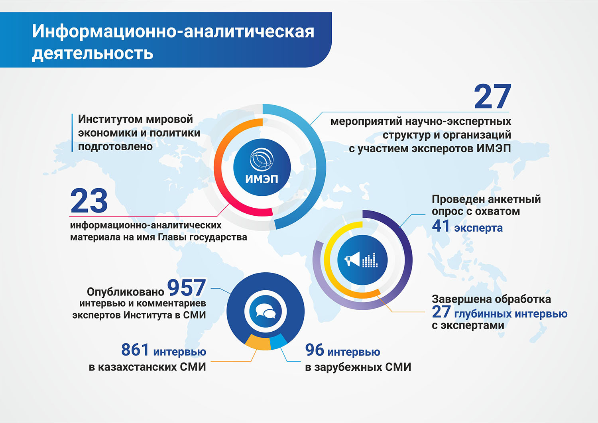
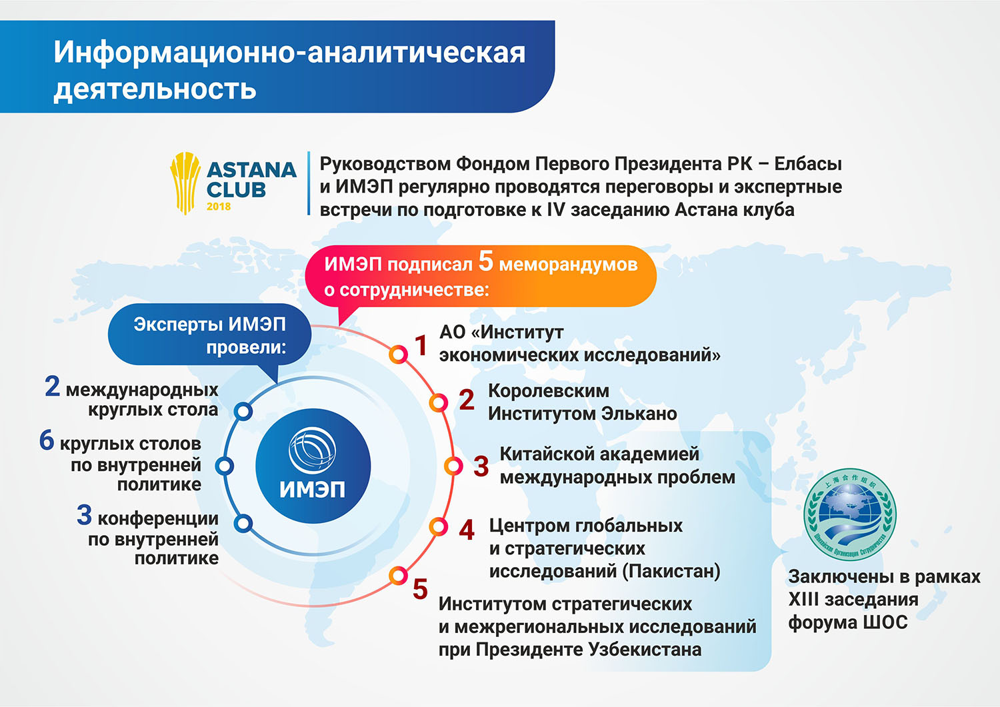

**За отчетный период Институтом мировой экономики и политики подготовлено 23
информационно-аналитических материала на имя Главы государства. Эксперты
Института приняли участие в 27 мероприятиях научно-экспертных структур и организаций.**

Эксперты программы «Внутриполитические и социальные исследования» разработали анкету экспертного опроса в рамках исследовательского проекта «Реализация модернизации 3.0 в Казахстане: ресурсы, ограничения и перспективы». Проведён анкетный опрос с охватом 41 эксперта и завершена обработка 27 интервью с экспертами. Готовится аналитический доклад по данной теме.

Опубликовано 846 интервью и комментариев экспертов Института в СМИ, из них для сайта ИМЭП – 160 и в зарубежных СМИ – 82.

За период с января по август 2018г. эксперты ИМЭП провели 2 международных круглых стола на тему «Центральная Азия и Россия: создание общего будущего» (совместно с Российским советом по международным делам и Информационно-аналитическим центром МГУ им. М. В. Ломоносова) и «Соединяя Евразию: роль Казахстана между Европой и Восточной Азией» (совместно с Королевским Институтом Элькано при поддержке Посольства РК в Королевстве Испания).

ИМЭП провёл 6 круглых столов и 2 конференции по внутренней политике: участники обсуждали такие темы, как «Новые возможности Казахстана в условиях четвертой промышленной революции», «Человеческий капитал – основа модернизации Казахстана», «Центральная Азия: перспективы сотрудничества и вызовы безопасности», вопросы жилищной политики в стране, роль мозговых центров в Казахстане и переход казахского алфавита на латиницу.

С начала года ИМЭП подписал 5 меморандумов о сотрудничестве: с АО «Институт экономических исследований» и Королевским Институтом Элькано, Китайской академией международных проблем, Центром глобальных и стратегических исследований (Пакистан) и Институтом стратегических и межрегиональных исследований при Президенте Узбекистана. Следует отметить, что с тремя последними think-tanks ИМЭП заключил соглашения в рамках XIII заседания форума ШОС, организаторами которого выступили ИМЭП и МИД РК.

Кроме того, установлены контакты с ведущими американскими think-tank: Институтом Брукингса, Центром стратегических и международных исследований (CSIS), Центром имени В. Вильсона, корпорацией RAND, Фондом Карнеги за международный мир и другими аналитическими центрами США.

Руководством ИМЭП и Фондом Первого Президента РК – Елбасы в преддверии подготовки к IV заседанию Астана клуба регулярно проводятся переговоры и экспертные встречи.

Так в рамках программы Global Challenges Summit на платформе Астанинского экономического форума эксперты ИМЭП провели панельную сессию Астана Клуба – «Состоится ли Большая Евразия? В поисках ответов на критические вызовы геоэкономики». В дискуссии приняли участие известные в мировом научно-экспертном сообществе специалисты: директор Оксфордского центра византийских исследований и автор бестселлера «Шёлковые пути. Новая история мира» Питер Франкопан (Великобритания), министр по интеграции и макроэкономике ЕЭК Татьяна Валовая (РФ), профессор Школы международных и общественных отношений при Университете международных исследований Шанхая Ян Чэн (КНР), директор проекта Reconnecting Asia Project Джонатан Хиллман (США), председатель Institut Choiseul Паскаль Лоро (Франция).

Состав ИМЭП на сегодняшний день включает 25 человек, из них к административно-управленческому персоналу относятся – 13, к экспертному составу – 12 сотрудников.

**Руководством Фондом Первого Президента РК – Елбасы и ИМЭП регулярно проводятся переговоры и экспертные встречи по подготовке к IV заседанию Астана клуба.**

