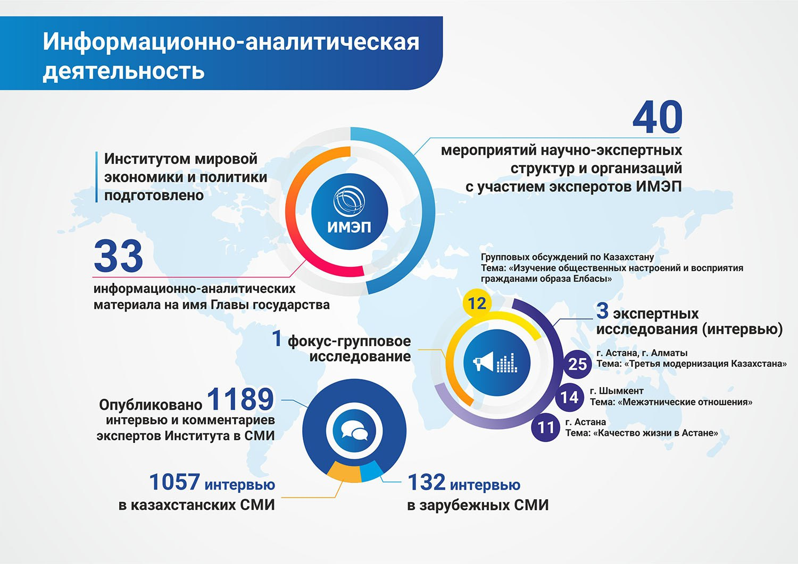

**За отчетный период Институтом мировой экономики и политики подготовлено 23
информационно-аналитических материала на имя Главы государства. Эксперты
Института приняли участие в 27 мероприятиях научно-экспертных структур и организаций.**

Эксперты программы «Внутриполитические и социальные исследования» разработали анкету экспертного опроса в рамках исследовательского проекта «Реализация модернизации 3.0 в Казахстане: ресурсы, ограничения и перспективы». Проведён анкетный опрос с охватом 41 эксперта и завершена обработка 27 интервью с экспертами. Готовится аналитический доклад по данной теме.

Опубликовано 846 интервью и комментариев экспертов Института в СМИ, из них для сайта ИМЭП – 160 и в зарубежных СМИ – 82.

За отчетный период Институтом мировой экономики и политики подготовлено **30** информационно-аналитических материала на имя Главы государства.

Опубликовано **1004** интервью и комментариев экспертов Института в СМИ, из них **905** в казахстанских и **99** в зарубежных СМИ.

Эксперты Института приняли участие в **31** мероприятии научно-экспертных структур и организаций.

За период с января по сентябрь т. г. эксперты ИМЭП провели **5 международных конференций**:

- в Москве (РФ) на тему: «Центральная Азия и Россия: создание общего будущего», совместно с Российским советом по международным делам при МИД РФ и МГУ;
- в Мадриде (Испания) «Соединяя Евразию: роль Казахстана между Европой и Восточной Азией» совместно с крупнейшим мозговым центром Испании по вопросам внешней политике – Королевским Институтом Элькано;
- в Алматы на тему: «Инициатива Китая «Пояс и путь»: взгляд из Центральной Азии» с ведущими независимыми экспертами из стран Центральной Азии.
- в Астане на тему «Казахстанско-японское сотрудничество в ядерном разоружении: одна судьба, общие цели», совместно с **Фондом мира Гои**;
- в Астане на площадке АЭФ провели **панельную сессию Астана Клуба** на тему «Геоэкономика Евразии». Участниками стали свыше **60** экспертов по геоэкономике Евразии, включая автора бестселлера «Шёлковые пути. Новая история мира» **Питера Франкопана** (Великобритания), министра по интеграции ЕЭК **Татьяны Валовой** (РФ), директора проекта Reconnecting Asia **Джонатана Хиллмана** (США) и многих других.

ИМЭП провел **8** круглых столов по **внутренней политике и экономике Казахстана**. Темами для обсуждения стали такие вопросы, как новые возможности Казахстана в условиях четвертой промышленной революции, человеческий капитал, вопросы жилищной политики, повышение эффективности национальных мозговых центров и переход казахского алфавита на латиницу.

С начала года ИМЭП подписал **5 меморандумов о сотрудничестве с**:

- Королевским Институтом Элькано (Испания);
- АО «Институт экономических исследований»;
- Китайской академией международных проблем (КНР);
- Центром глобальных и стратегических исследований (Пакистан);
- Институтом стратегических и межрегиональных исследований при Президенте Узбекистана.

В июне ИМЭП выступил организатором **XIII заседания форума ШОС в Астане**, собравшего ведущие мозговые центры стран ШОС, включая Индию и Пакистан. В форуме приняли участие **более 100** экспертов и официальных лиц.

Кроме того, в ходе визита в США установлены контакты с ведущими **американскими think-tank** такими как: Институт Брукингса, Центра стратегических и международных исследований (CSIS), Центр им. Вильсона, Корпорация RAND, Фонд Карнеги и другими аналитическими центрами.

**Руководством Фондом Первого Президента РК – Елбасы и ИМЭП регулярно проводятся переговоры и экспертные встречи по подготовке к IV заседанию Астана клуба.**

